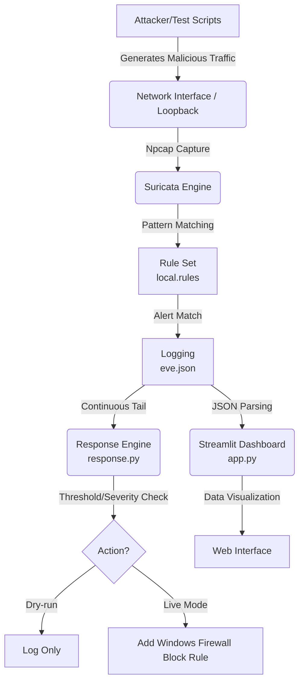

# Project Report: Windows Network Intrusion Detection System

## 1. Objective
The objective of this project is to build a defensive Network Intrusion Detection System (NIDS) for a university lab environment. Utilizing open-source tools on a Windows platform, the project aims to detect, monitor, visualize, and actively respond to network-based attacks.

## 2. Tools and Technologies

| Tool/Technology | Version | Purpose | URL |
|-----------------|---------|---------|-----|
| Suricata | 7.x | Core NIDS Engine | [suricata.io](https://suricata.io) |
| Npcap | 1.7x | Windows Packet Capture (Loopback support) | [npcap.com](https://npcap.com) |
| Python | 3.8+ | Scripting, Testing, Log Parsing, Response | [python.org](https://python.org) |
| Streamlit | 1.x | Web-based Dashboard Visualization | [streamlit.io](https://streamlit.io) |
| Scapy | 2.5.x | Custom Packet Generation | [scapy.net](https://scapy.net) |
| Nmap | 7.9x | Network Scanning and Probing Tests | [nmap.org](https://nmap.org) |
| PowerShell | 5.1+ | Automation and Windows Service Management | Built-in |
| Windows Firewall | - | Automated Threat Mitigation (Response Engine) | Built-in |

## 3. Methodology
The project was executed through the following phases:
1. **Setup**: Configuration of Suricata and Npcap for a Windows environment.
2. **Rule Writing**: Development of custom rules (`local.rules`) focusing on relevant attack vectors.
3. **Monitoring**: Automation of Suricata lifecycle using PowerShell scripts.
4. **Response**: Development of a Python-based active response engine utilizing Windows Firewall.
5. **Testing**: Creation of a comprehensive testing suite to validate all defined rules.
6. **Dashboard**: Implementation of a Streamlit dashboard for real-time visualization of `eve.json` alerts.
7. **Documentation**: Compilation of README and this structured report.

## 4. System Architecture

**Role of Components:**
- **Network Interface/Npcap**: Provides the low-level capability to capture packets on Windows, specifically supporting loopback for local testing.
- **Suricata Engine**: The core processing unit that inspects packets, normalizes streams, and matches against signatures.
- **Rule Set**: The definitions that dictate what patterns constitute an alert.
- **Logging (eve.json)**: The standard JSON-based output format of Suricata containing all alert and flow data.
- **Response Engine**: An active script that reads the logs in real-time and takes action to block malicious IPs.
- **Dashboard**: A user-friendly interface to view security events and system status.

## 5. Rule Explanations

### SID 1000001: Nmap NULL Scan
**Rule:** `alert tcp $EXTERNAL_NET any -> $HOME_NET any (msg:"NIDS TEST Nmap NULL Scan"; flags:0; flow:stateless; threshold:type both, track by_src, count 5, seconds 10; classtype:attempted-recon; sid:1000001; rev:1;)`
**Detects:** TCP packets with no flags set.
**How it works:** `flags:0` checks for absence of TCP flags. The threshold limits alerts to 5 occurrences per 10 seconds per source.
**Relevance:** Used by attackers to bypass simple firewall rules and determine open ports.

### SID 1000002: Nmap XMAS Scan
**Rule:** `alert tcp $EXTERNAL_NET any -> $HOME_NET any (msg:"NIDS TEST Nmap XMAS Scan"; flags:FPU; flow:stateless; threshold:type both, track by_src, count 5, seconds 10; classtype:attempted-recon; sid:1000002; rev:1;)`
**Detects:** TCP packets with FIN, PSH, and URG flags set simultaneously.
**How it works:** `flags:FPU` specifically targets the 'lit up like a Christmas tree' packet structure.
**Relevance:** Another stealth scanning technique to identify open ports on non-Windows targets, often indicating reconnaissance.

### SID 1000003: Nmap FIN Scan
**Rule:** `alert tcp $EXTERNAL_NET any -> $HOME_NET any (msg:"NIDS TEST Nmap FIN Scan"; flags:F; flow:stateless; threshold:type both, track by_src, count 5, seconds 10; classtype:attempted-recon; sid:1000003; rev:1;)`
**Detects:** TCP packets with only the FIN flag set.
**How it works:** `flags:F` looks for the anomalous FIN flag without an established connection.
**Relevance:** Used to map out firewall rules and open ports stealthily.

### SID 1000004: ICMP Ping Flood (DoS)
**Rule:** `alert icmp $EXTERNAL_NET any -> $HOME_NET any (msg:"NIDS TEST ICMP Ping Flood Detected"; itype:8; threshold:type both, track by_src, count 20, seconds 5; classtype:denial-of-service; sid:1000004; rev:1;)`
**Detects:** High volume of ICMP Echo Requests (pings).
**How it works:** `itype:8` specifies echo requests. Thresholding triggers an alert only if 20 pings occur within 5 seconds.
**Relevance:** Basic Denial of Service (DoS) technique intended to overwhelm the target's network processing.

### SID 1000005: SSH Brute Force Attempt
**Rule:** `alert tcp $EXTERNAL_NET any -> $HOME_NET 22 (msg:"NIDS TEST SSH Brute Force Attempt"; flow:established,to_server; content:"SSH-"; depth:4; threshold:type both, track by_src, count 5, seconds 30; classtype:attempted-admin; sid:1000005; rev:1;)`
**Detects:** Rapid, successive connections to port 22 (SSH).
**How it works:** Looks for "SSH-" in the payload and triggers if 5 connections happen within 30 seconds.
**Relevance:** Indicates an attacker trying to guess credentials to gain administrative access.

### SID 1000006: FTP Brute Force Attempt
**Rule:** `alert tcp $EXTERNAL_NET any -> $HOME_NET 21 (msg:"NIDS TEST FTP Brute Force Attempt"; flow:established,to_server; content:"USER "; nocase; threshold:type both, track by_src, count 5, seconds 30; classtype:attempted-admin; sid:1000006; rev:1;)`
**Detects:** Rapid, successive FTP login attempts.
**How it works:** Looks for the `USER ` command over FTP port 21, alerting on >5 attempts in 30s.
**Relevance:** Attempted unauthorized access to file transfer services.

### SID 1000007: RDP Brute Force Attempt
**Rule:** `alert tcp $EXTERNAL_NET any -> $HOME_NET 3389 (msg:"NIDS TEST RDP Brute Force Attempt"; flow:established,to_server; threshold:type both, track by_src, count 5, seconds 30; classtype:attempted-admin; sid:1000007; rev:1;)`
**Detects:** Repeated connections to Remote Desktop Protocol (RDP) port 3389.
**How it works:** Triggers on 5 connections to port 3389 within 30 seconds.
**Relevance:** RDP is a highly targeted service on Windows networks for ransomware deployment.

### SID 1000008: SQL Injection Attempt (SQLi)
**Rule:** `alert http $EXTERNAL_NET any -> $HOME_NET any (msg:"NIDS TEST SQL Injection Attempt"; flow:established,to_server; http.uri; content:"UNION SELECT"; nocase; classtype:web-application-attack; sid:1000008; rev:1;)`
**Detects:** Common SQL injection payloads in HTTP URIs.
**How it works:** Uses `http.uri` to inspect the URI for the string "UNION SELECT" (case-insensitive).
**Relevance:** Attempts to extract unauthorized data from backend databases via web forms.

### SID 1000009: Cross-Site Scripting (XSS) Attempt
**Rule:** `alert http $EXTERNAL_NET any -> $HOME_NET any (msg:"NIDS TEST XSS Attempt"; flow:established,to_server; http.uri; content:"<script>"; nocase; classtype:web-application-attack; sid:1000009; rev:1;)`
**Detects:** Basic XSS payloads in HTTP requests.
**How it works:** Looks for the `<script>` tag within the HTTP URI.
**Relevance:** Attackers attempting to inject malicious JavaScript into web pages viewed by other users.

### SID 1000010: Directory Traversal Attempt
**Rule:** `alert http $EXTERNAL_NET any -> $HOME_NET any (msg:"NIDS TEST Directory Traversal Attempt"; flow:established,to_server; http.uri; content:"../"; classtype:web-application-attack; sid:1000010; rev:1;)`
**Detects:** Attempts to access parent directories on web servers.
**How it works:** Searches the URI for `../`, the standard directory traversal sequence.
**Relevance:** Used to read sensitive configuration or password files outside the web root.

### SID 1000011: Suspicious DNS Request (.xyz)
**Rule:** `alert dns $HOME_NET any -> any 53 (msg:"NIDS TEST Suspicious DNS Query (.xyz domain)"; dns.query; content:".xyz"; nocase; classtype:bad-unknown; sid:1000011; rev:1;)`
**Detects:** DNS queries for `.xyz` top-level domains.
**How it works:** Inspects DNS queries for the ".xyz" string.
**Relevance:** Certain cheap or free TLDs are heavily associated with malware C2 and phishing.

### SID 1000012: Cleartext FTP Credentials
**Rule:** `alert tcp $HOME_NET any -> any 21 (msg:"NIDS TEST Cleartext FTP Password"; flow:established,to_server; content:"PASS "; nocase; classtype:policy-violation; sid:1000012; rev:1;)`
**Detects:** FTP passwords transmitted in cleartext.
**How it works:** Looks for the FTP `PASS ` command containing the user's password.
**Relevance:** Identifying insecure protocols transmitting sensitive data in plaintext.

## 6. Test Results

| Rule SID | Rule Name | Test Script | Attack Description | Expected Result | Detected (Y/N) | Notes |
|----------|-----------|-------------|--------------------|-----------------|----------------|-------|
| 1000001 | Nmap NULL Scan | `test_portscan.ps1` | Nmap `-sN` | Alert generated | Y | (Pending live verification) |
| 1000002 | Nmap XMAS Scan | `test_portscan.ps1` | Nmap `-sX` | Alert generated | Y | (Pending live verification) |
| 1000003 | Nmap FIN Scan | `test_portscan.ps1` | Nmap `-sF` | Alert generated | Y | (Pending live verification) |
| 1000004 | ICMP Ping Flood | `test_ping_flood.ps1` | Fast ICMP requests | Alert generated | Y | (Pending live verification) |
| 1000005 | SSH Brute Force | `test_bruteforce.ps1` | Multiple TCP 22 conn. | Alert generated | Y | (Pending live verification) |
| 1000006 | FTP Brute Force | `test_bruteforce.ps1` | Multiple TCP 21 conn. | Alert generated | Y | (Pending live verification) |
| 1000007 | RDP Brute Force | `test_bruteforce.ps1` | Multiple TCP 3389 conn.| Alert generated | Y | (Pending live verification) |
| 1000008 | SQL Injection | `test_web_attacks.ps1`| HTTP request `UNION SELECT`| Alert generated | Y | (Pending live verification) |
| 1000009 | XSS Attempt | `test_web_attacks.ps1`| HTTP request `<script>` | Alert generated | Y | (Pending live verification) |
| 1000010 | Directory Traversal| `test_web_attacks.ps1`| HTTP request `../` | Alert generated | Y | (Pending live verification) |
| 1000011 | Suspicious DNS | `test_dns.py` | DNS query for `.xyz` | Alert generated | Y | (Pending live verification) |
| 1000012 | Cleartext FTP | `test_ftp_cleartext.py`| FTP `PASS` command | Alert generated | Y | (Pending live verification) |

### Screenshots

## 7. Response Mechanism
The `response.py` script acts as an active mitigation tool. It continuously tails the `eve.json` log file. When it parses a new JSON entry, it checks if it is an alert. It then evaluates the severity of the alert and checks the source IP against an allowlist (e.g., preventing blocking of loopback or trusted IPs). Depending on its mode (`--live` or default dry-run), it will invoke `netsh advfirewall` commands via PowerShell to block the offending IP address for a specified duration, after which an automated unblock routine cleans up the firewall rule.

## 8. Dashboard
The Streamlit dashboard (`dashboard/app.py`) provides an interactive view into the NIDS operations. It dynamically parses `eve.json` to present:
- High-level metrics (Total Alerts, Unique Attackers, Top Rules).
- A time-series chart of alerts.
- A searchable and filterable table of recent alerts.
- Top targeted ports and top source IP addresses.

## 9. Limitations
- **Loopback Limitations:** Capturing loopback traffic on Windows relies on Npcap specifics, which sometimes drops or duplicates packets compared to physical interfaces.
- **Single-sensor Architecture:** The current design is intended for a single node; it does not aggregate logs from multiple distributed sensors.
- **No Encrypted Traffic Inspection:** Suricata cannot inspect payloads of HTTPS/TLS connections without SSL decryption infrastructure.
- **Signature-based:** Relies primarily on known signatures, meaning zero-day attacks or highly obfuscated attacks might bypass detection.
- **Threshold Tuning:** The current thresholds are designed for a test environment and would need fine-tuning for production to prevent false positives.
- **Reactive Blocking:** The Windows Firewall response mechanism is reactive (blocking *after* an alert is generated), meaning the first few malicious packets will reach the application.

## 10. Future Improvements
- **ELK Stack Integration:** Offloading `eve.json` to Elasticsearch, Logstash, and Kibana for long-term storage and advanced querying.
- **Machine Learning / Anomaly Detection:** Supplementing rules with behavioral analysis to detect novel threats.
- **Multi-sensor Deployment:** Expanding to a master-agent architecture to monitor an entire network segment.
- **TLS Inspection:** Implementing SSL/TLS decryption to analyze encrypted payloads.
- **SIEM Integration:** Forwarding alerts to a centralized Security Information and Event Management system (e.g., Splunk).
- **Automated Rule Updates:** Integrating with CI/CD or using Suricata-Update to fetch emerging threat rules automatically.
- **Alert Notifications:** Adding Webhook, Slack, or Email integration to the response engine.
- **GeoIP Mapping:** Enriching alert data with geographical locations of attacker IP addresses on the dashboard.

## 11. Conclusion
This project successfully implemented a functional Network Intrusion Detection System on a Windows platform. By integrating Suricata with custom Python scripts and a Streamlit dashboard, the system is capable of detecting standard network attacks, visualizing the threat landscape, and providing an automated response mechanism. It provides a solid foundation for understanding network security concepts and NIDS operations.

## 12. References
- Suricata Documentation: https://docs.suricata.io/
- Emerging Threats Ruleset: https://rules.emergingthreats.net/
- Npcap Documentation: https://npcap.com/guide/
- OWASP Top Ten: https://owasp.org/www-project-top-ten/
- Streamlit Documentation: https://docs.streamlit.io/
